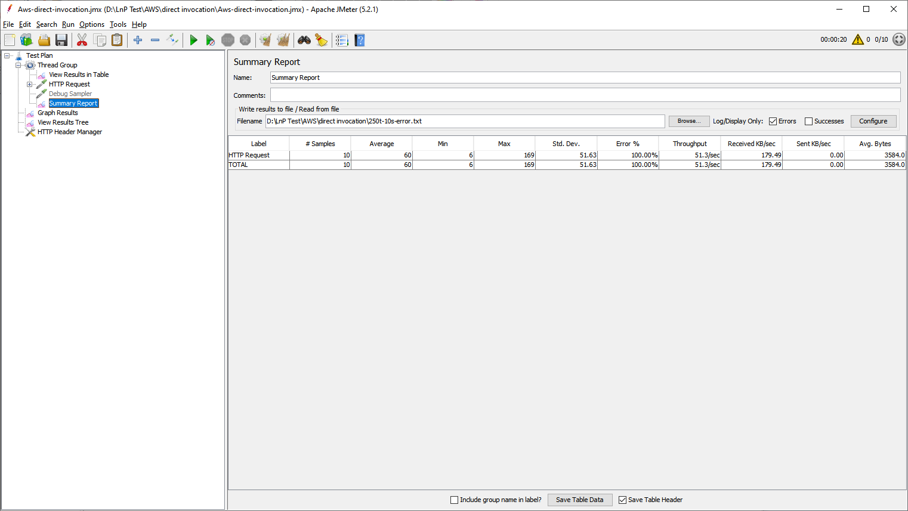

# Introduction
This README document explains the the JMeter profiles used for Load and Performance Testing the cloud functions (without and with using workload smoother).

Experiments were conducted using JMeter version 5.2.1 - JMeter can be downloaded [here](https://jmeter.apache.org/download_jmeter.cgi).

# Direct Invocation
In this setup, we use JMeter to directly invoke the testing cloud function (i.e., factorial functions). After installing and start the JMeter, the test can be conducted as:

1. Import the test plan by choosing File -> Open. Select the [Aws-direct-invocation.jmx](Aws-direct-invocation.jmx). This example use AWS Lambda as an example but same apply to Azure cloud function as well.
2. After importing, the test plan will display as:

In this window, user can configure:
* How many threads will be used in the test? - (Number of Threads (users))
* How long does it take to ramp to this number of thread? - (Ramp-up period (seconds))
* Do you want to test infinitely? - i.e., JMeter will keep sending the request until user "Stop" the test. If not, user can configure how many request each thread will send (Loop Count).

3. HTTP Request configuration

In this window, user can configure:
* The invocation method (GET, POST, etc)
* The path: this is the URL to invoke your cloud function or workload smoother.
* The Body of the request

After this configuration, user can start the test by clicking the green Play button on the top of JMeter.

4. Summary Report

Once the test is completed, summary report window will show the result (can choose to see the error or success calls)

5. Graph Results

The results can be represented as graph using Graph Results window. In this result, you can view: Number of Samples (requests), Throughput, Average and Median response time and Standard deviation (Deviation).

6. View Results Tree

In this window, user can view the sampler result, request and response data. There is also an option to save these data into a file for offline processing.

# Invoke via A Workload Smoother
1. Import the test plan by choosing File -> Open. Select the [Workload-Smoother.jmx](Workload-Smoother.jmx).

2. All the steps from 1-6 using direct invocation apply to invoke via a workload smoother. The only difference is as follow:
* In Thread Group window: user needs to configure how many requests will be used. This is because, we tested with direct invocation first. The test used "infinite" option and we stopped when the throughput was relatively constant (saturated). We recorded the total number of requests and thus used this same total number of request for the second test with workload smoother.

* In the HTTP Request window: user needs to change the Path to point to the workload smoother instead.
